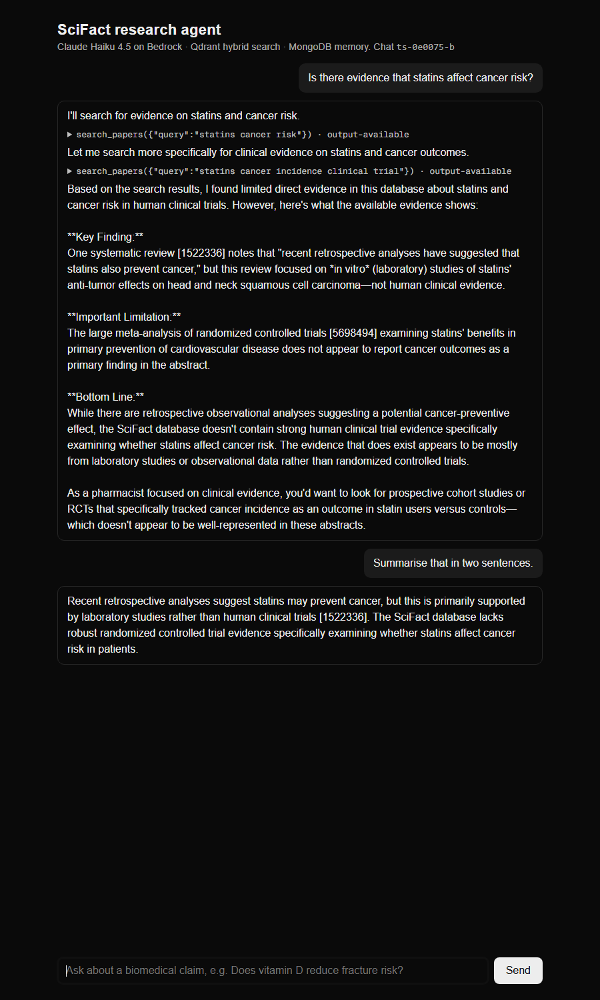

# ai-sdk-research-agent

A streaming research agent in TypeScript: **Next.js + the Vercel AI SDK**, **Claude Haiku 4.5 on
AWS Bedrock**, hybrid retrieval from **Qdrant** (BM25 + dense, fused with RRF) and **MongoDB** for
chat history, long-term memory and per-call telemetry.

**Live demo: [ai-sdk-research-agent.vercel.app](https://ai-sdk-research-agent.vercel.app)**
(runs on Groq instead of Bedrock, see [Public deployment](#public-deployment)).

It is the TypeScript counterpart of
[agent-memory-lab](https://github.com/RahulRachhoya/agent-memory-lab), which built the same agent
in Python with LangGraph and benchmarked the retrieval. This repo reuses that Qdrant collection
and asks two questions:

1. **Can the retrieval be ported to TypeScript exactly**, so a Node service can query an index
   that a Python pipeline built? It was checked query by query against the Python output.
2. **What does the Vercel AI SDK's agent loop look like with real persistence and telemetry?**
   Streaming UI, history in MongoDB, and one document per LLM step and tool call.



## Retrieval parity with the Python reference

The agent searches the SciFact collection that agent-memory-lab built: 5,183 abstracts, a
`bge-small-en-v1.5` dense vector and a BM25 sparse vector per document. To query it from
TypeScript, both query encoders had to be reproduced:

- **BM25 query tokens** port fastembed's `Qdrant/bm25` exactly:
  - the same Unicode-aware punctuation stripping (Python's `\w`, written as `\p{L}\p{N}\p{M}\p{Pc}`);
  - the same stopword list and the same Snowball English stemmer;
  - the same MurmurHash3 (x86, 32-bit, signed) token ids.
- **Dense query vectors** come from transformers.js running the ONNX export of the same model, with
  CLS pooling, L2 normalisation and the same retrieval prefix.

`scripts/parity.mts` checks all 300 SciFact test claims against a fixture written by the Python
code (`scripts/make_fixture.py`). The results are in `docs/parity.json`:

| Check (300 queries) | Result |
|---|---|
| BM25 token ids identical to Python | **300 / 300** |
| Dense query vector cosine vs Python | min 0.99999, mean 0.999999 |
| Hybrid top-10 overlap with Python | 0.998 |
| Query embedding in Node (transformers.js, CPU) | 9.9 ms p50, 14.7 ms p95 |

The same 300 queries through Qdrant, via the TypeScript path:

| Method | nDCG@10 TS | nDCG@10 Python | Recall@100 TS | Recall@100 Python |
|---|---:|---:|---:|---:|
| dense | 0.713 | 0.713 | 0.942 | 0.942 |
| BM25 | 0.683 | 0.683 | 0.921 | 0.921 |
| hybrid (RRF, k=60) | 0.720 to 0.728 | 0.725 | 0.965 | 0.965 |

Dense and BM25 match exactly. The hybrid row moves by a few thousandths between runs *with
identical inputs*. Repeating the identical hybrid request reordered the top 10 for 49 of the
300 queries. RRF produces exact score ties (a document ranked 3rd by one retriever and 7th by the
other scores the same as one ranked 7th and 3rd), and Qdrant breaks ties arbitrarily. So a
single hybrid nDCG figure, including the Python repo's 0.725, carries roughly ±0.004 of
tie-breaking noise.

## Finding: the HTTP client decided Qdrant latency

The same REST query to the same local Qdrant, from Node, p50 over 300 queries:

| Client | dense | BM25 | hybrid |
|---|---:|---:|---:|
| `node:http` with a keep-alive agent (used by the agent) | **3.0 ms** | 1.9 ms | **3.0 ms** |
| `undici.request` | 15.2 ms | 15.2 ms | 15.2 ms |
| `@qdrant/js-client-rest` (uses `fetch`) | 60.9 ms | 15.2 ms | 60.3 ms |

Qdrant's official JS client was 20 times slower than `node:http` for dense queries. It sends the
request through `fetch()`, and a dense query carries about 8 KB of JSON. BM25 queries have tiny
bodies and ran at 15 ms. The agent sends queries with `node:http`, which puts REST on par with
the Python client's gRPC (3.2 ms p50 in agent-memory-lab).

I haven't investigated the cause, and the setup is one Windows machine with Docker Desktop, so
measure your own client before choosing one.

## The agent

```
browser (useChat)                     Next.js route /api/chat              services
─────────────────                     ───────────────────────              ────────
sendMessage({text}) ── {id, message} ─▶ chatTurn()
                                        ├─ load chat (MongoDB chats)
                                        ├─ validateUIMessages(history + new)
                                        ├─ saved memories → system prompt
                                        ├─ streamText(Claude Haiku 4.5, Bedrock)
                                        │    tools: search_papers ──────────▶ Qdrant hybrid (RRF)
                                        │           remember / recall ─────▶ MongoDB memories
                                        │    onStepEnd ────────────────────▶ MongoDB llm_calls
                                        │    onToolExecutionEnd ───────────▶ MongoDB tool_calls
◀── UI message stream (SSE) ─────────── └─ toUIMessageStream → onEnd: save chat
```

- **Server-owned history.** The browser sends only its newest message; the server loads the
  conversation from MongoDB, validates it against the current tool schemas and saves the whole
  `UIMessage` list when the stream ends. A reload of `/?chat=<id>` restores the conversation,
  tool calls included. `result.consumeStream()` makes the turn finish and save even if the tab
  closes mid-answer.
- **Memory in the prompt.** Saved facts are injected into the system prompt every turn. In the
  Python version the model ignored an instruction to call `recall` first, so this agent doesn't
  rely on it. `recall` still exists for searching older facts.
- **Telemetry from lifecycle callbacks.** `onStepEnd` writes one `llm_calls` document per model
  step. It records tokens split into fresh / cache read / cache write, response time, **time to
  first output** and cost. `onToolExecutionEnd` writes one `tool_calls` document per call. Both
  writes are awaited before the chat is saved, so a finished turn always has its telemetry.
- **Same schema as the Python agent**, so the aggregation pipelines are the same (ported in
  `scripts/report.mts`). It uses its own database, `agent_lab_ts`, so the two agents don't read
  each other's memories.

### Demo run

`scripts/demo.mts` replays the Python agent's scripted demo (5 turns in 3 sessions for one user)
through the same `chatTurn()` stream the web route uses. Output of `scripts/report.mts` for that
run. The full transcript is in `docs/demo-run.md`.

| session | LLM calls | input tokens | output tokens | cost | tool calls | LLM ms | tool ms |
|---|---:|---:|---:|---:|---:|---:|---:|
| a (2 turns) | 6 | 20,092 | 874 | $0.0245 | 6 | 18,062 | 201 |
| b (2 turns) | 4 | 8,358 | 477 | $0.0107 | 2 | 8,418 | 84 |
| c (1 turn) | 3 | 5,669 | 359 | $0.0075 | 2 | 5,798 | 83 |

| | calls | p50 | p95 |
|---|---:|---:|---:|
| LLM step, full response | 13 | 1,511 ms | 8,191 ms |
| LLM step, time to first output | 13 | 982 ms | 1,953 ms |
| `search_papers` tool | 9 | 41.9 ms | 61.1 ms |

What the run shows:

- **Streaming hides most of the wait.** The four answer steps that followed a search took 3.1 to
  8.2 seconds end to end, but their first output arrived after 0.94 to 0.99 seconds.
- **The model is the cost and the latency.** LLM steps were 98.9% of the measured time (32.3 s
  against 0.37 s in tools). Input tokens were 80% of the $0.043 total, because each step resends
  the history plus up to 3,700 characters of abstracts per search. This is the same split the
  Python agent showed ($0.044 for the same script).
- **Memory carried across chats.** In session a the model saved "User is a pharmacist who only
  cares about human clinical evidence, not mouse studies". Session b is a new chat with no shared
  history, and its first answer ended with "As a pharmacist focused on clinical evidence, you'd
  want to look for prospective cohort studies or RCTs...".
- **Search in the agent was 42 ms p50 against about 18 ms in a warm loop.** The loop time is
  9 ms of embedding, 0.3 ms of BM25 tokenising and 8 ms for Qdrant with payloads. The first query
  in a loop also took 30 ms, so the likely cause is reconnecting after multi-second LLM waits.
  I didn't pin it down; at 1% of turn time it doesn't matter.

A logged LLM step and tool call:

```json
{"session_id": "ts-0e0075-c", "user_id": "demo-user-0e0075", "model": "global.anthropic.claude-haiku-4-5-20251001-v1:0",
 "step": 0, "input_tokens": 898, "output_tokens": 81, "cache_read_tokens": 0, "cache_write_tokens": 0,
 "latency_ms": 1156.5, "ttft_ms": 746, "cost_usd": 0.001303, "stop_reason": "tool_use"}
{"session_id": "ts-0e0075-c", "user_id": "demo-user-0e0075", "tool": "search_papers",
 "args": {"query": "beta blockers heart attack myocardial infarction post-MI"},
 "ok": true, "error": null, "latency_ms": 54.1, "result_chars": 3776}
```

## Bug worth knowing: MongoDB stores `undefined` as `null`

The first demo run failed on the second turn. The AI SDK leaves optional fields on message parts
as `undefined` (`providerMetadata`, `rawInput`, ...). The MongoDB Node driver stores them as
`null` by default. When the chat was loaded for the next turn, `validateUIMessages` rejected
`null` where the schema allows only a string or a missing field. The fix is one option,
`new MongoClient(uri, { ignoreUndefined: true })`, and `tests/memory.test.ts` has a round-trip
regression test that fails without it.

## Public deployment

The same code runs as a public demo at
[ai-sdk-research-agent.vercel.app](https://ai-sdk-research-agent.vercel.app). Three things change when anyone on the internet can open it:

- **No AWS credentials in the deployment.** `LLM_PROVIDER=groq` swaps the model for
  `openai/gpt-oss-120b` on Groq, so the deployment only holds a Groq API key. Every number in this
  README is from Claude Haiku 4.5 on Bedrock.
- **Search runs as its own service.** The embedding runtime doesn't fit in a Vercel function
  (onnxruntime-node alone is about 290 MB against a 250 MB limit). `service/search.mts` embeds the
  query and runs the hybrid query on Render, and the Vercel app calls it with a shared bearer
  token. A free Render service sleeps when idle, so opening the page sends a wake-up request while
  the visitor is still typing.
- **Spend is capped.** Each browser gets a random visitor id in a cookie (`src/proxy.ts`), so
  memories and chats are per visitor. `src/lib/limits.ts` allows 15 messages an hour per visitor
  and 40 per IP, and stops all chats once the day's model cost (summed from `llm_calls`) reaches $1.
  Messages are capped at 1,000 characters and chats at 20 messages. A read-only example chat (the
  demo run's session b) costs nothing to open.

```
browser ─▶ Vercel: Next.js page + /api/chat (limits) ─▶ Groq (gpt-oss-120b)
                         │                            ─▶ MongoDB Atlas (chats, memories, telemetry)
                         └─ bearer token ─▶ Render: service/search.mts ─▶ Qdrant Cloud (scifact)
```

## Run it

Needs agent-memory-lab's Docker services (MongoDB and Qdrant) with its SciFact collection
built, which is `uv run python -m agent_memory_lab.bench` there.

```bash
npm install
npm test                  # BM25 parity (300 queries), cost, MongoDB tests (skipped if MongoDB is down)
npm run parity            # full parity + latency check, writes docs/parity.json (no API calls)

# needs AWS credentials with Bedrock access: AWS_PROFILE (default claude-bedrock), AWS_REGION (default ap-south-1)
npm run demo              # 5 scripted turns, about $0.04
npm run report -- ts-     # aggregation report over the telemetry
npm run build && npm start   # chat UI on http://localhost:3000
```

To deploy, fill in `.env.deploy` (git-ignored), then copy the local Qdrant collection and the
example chat to the hosted services with `npx tsx scripts/deploy-data.mts`. Create the search
service on Render from `render.yaml` (it asks for `SEARCH_TOKEN`, `QDRANT_URL` and
`QDRANT_API_KEY`). The Vercel project needs `LLM_PROVIDER=groq`, `GROQ_API_KEY`, `MONGODB_URI`,
`SEARCH_URL` (the Render service's URL) and the same `SEARCH_TOKEN`. Vercel functions connect from
changing IPs, so the Atlas IP Access List needs `0.0.0.0/0`; without it every request fails with a
TLS `MongoServerSelectionError`.

The fixture in `fixtures/` is committed. Regenerating it needs agent-memory-lab next to this repo:
`uv run --project ../agent-memory-lab python scripts/make_fixture.py`.

## Layout

```
src/lib/
  bm25.ts          fastembed Qdrant/bm25 query encoder: tokenise, stopwords, Snowball stem, hash
  murmur3.ts       MurmurHash3 x86 32-bit, identical to Python's mmh3.hash
  dense.ts         bge-small-en-v1.5 query embeddings with transformers.js (ONNX, CPU)
  qdrant.ts        dense / BM25 / hybrid RRF queries; node:http, undici and js-client transports
  metrics.ts       nDCG@10, Recall@100, percentiles (same as the Python metrics.py)
  memory.ts        MongoDB: schema, indexes, sessions, memories, chats, telemetry, pricing
  agent.ts         tools, prompt, streamText loop with lifecycle-callback telemetry: chatTurn()
  search.ts        search_papers backend: Qdrant in-process locally, the search service when deployed
  limits.ts        per-visitor, per-IP and daily-budget limits for the public route
src/proxy.ts       gives each browser a random visitor id cookie
service/
  search.mts       the deployed search service: embed + hybrid query behind a bearer token
src/app/
  api/chat/route.ts   POST {id, message} → UI message stream
  page.tsx            server component: loads the chat from MongoDB by ?chat=<id>
  chat.tsx            client component: useChat, renders Markdown answers and tool parts
scripts/
  parity.mts       TS vs Python retrieval parity and client latency → docs/parity.json
  demo.mts         the scripted 5-turn demo through chatTurn()
  report.mts       aggregation pipelines: per session, per tool, LLM latency and TTFT
  make_fixture.py  writes fixtures/scifact-test.json from the Python reference
  deploy-data.mts  copies the Qdrant collection and the example chat to Qdrant Cloud and Atlas
render.yaml        Render Blueprint for the search service
tests/             vitest: BM25 parity, murmur3, cost, MongoDB round trips
```

## Limitations

- **A demo, not an evaluation.** Five turns show the plumbing and the cost and latency structure,
  not answer quality. The answers also show SciFact's limits: it is a claim-verification corpus,
  and for several questions the agent correctly says the abstracts don't cover them.
- **One machine.** The transport latencies are from Windows with Docker Desktop; on Linux the
  `fetch` and `undici` penalties may be smaller or absent.
- **Limits, not auth.** Visitor ids are cookies and the per-IP limit trusts `x-forwarded-for`, so
  someone clearing cookies from many addresses gets past both. The daily budget is the real
  ceiling. Limit checks and the request insert aren't atomic, so a burst of parallel requests can
  go a few over.
- **The public demo runs a different model.** Its answers and costs aren't comparable with the
  Bedrock numbers above.
- **No prompt caching.** The stable prefix (instructions plus tool schemas) is well under Haiku's
  minimum cacheable length. For longer histories, caching the conversation prefix would be the
  first cost lever.

## License

MIT
